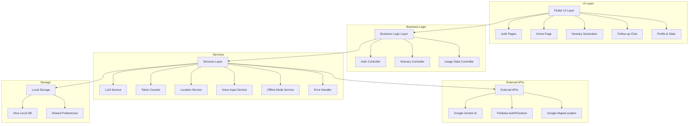
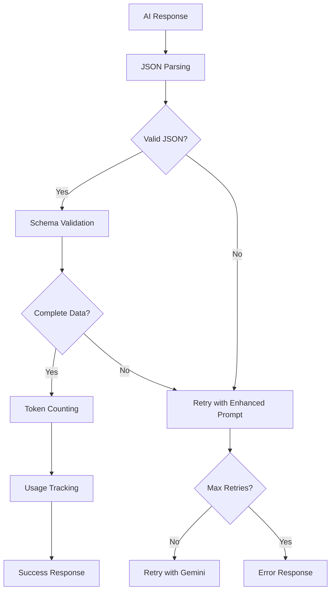

# Smart Trip Planner Flutter 🌍✈️

A sophisticated AI-powered travel planning application built with Flutter that leverages Google's Gemini AI to create personalized itineraries. The app features intelligent cost tracking, offline mode, voice input, and comprehensive error handling.

## 🏗️ Architecture Overview

The Smart Trip Planner follows clean architecture principles with clear separation of concerns:



📖 **[Detailed Architecture Documentation](./ARCHITECTURE.md)** - For comprehensive high-level and low-level design details.

## 🚀 Quick Setup

### Prerequisites
- Flutter SDK (3.27.0 or higher)
- Dart SDK (3.8.1 or higher)
- Firebase CLI
- Git

### Installation Steps

1. **Install Flutter and Dependencies**

   **macOS:**
   ```bash
   # Using Homebrew
   brew install flutter
   brew install firebase-cli
   
   # Verify installation
   flutter doctor
   ```

   **Windows:**
   ```powershell
   # Download Flutter SDK from https://docs.flutter.dev/get-started/install/windows
   # Extract to C:\flutter (or your preferred location)
   # Add C:\flutter\bin to your PATH environment variable
   
   # Install Firebase CLI using npm
   npm install -g firebase-tools
   
   # Or download from https://firebase.google.com/docs/cli
   
   # Verify installation
   flutter doctor
   ```

   **Linux (Ubuntu/Debian):**
   ```bash
   # Install Flutter via snap
   sudo snap install flutter --classic
   
   # Or download manually from https://docs.flutter.dev/get-started/install/linux
   
   # Install Firebase CLI
   curl -sL https://firebase.tools | bash
   
   # Verify installation
   flutter doctor
   ```

2. **Clone and Setup Project**
   ```bash
   git clone https://github.com/LordNydorf/smart_trip_planner_flutter.git
   cd smart_trip_planner_flutter
   flutter pub get
   ```

3. **Environment Configuration**
   ```bash
   # Create .env file with your API keys
   nano .env
   ```

   Required environment variables:
   ```env
   GEMINI_API_KEY=your_gemini_api_key_here
   FIREBASE_WEB_API_KEY=your_firebase_web_key
   FIREBASE_ANDROID_API_KEY=your_firebase_android_key
   FIREBASE_IOS_API_KEY=your_firebase_ios_key
   GOOGLE_MAPS_API_KEY=your_google_maps_key
   ```

4. **Firebase Configuration**
   ```bash
   # Login to Firebase
   firebase login
   
   # Configure FlutterFire
   flutterfire configure
   
   # Follow the interactive setup for your platforms
   ```

5. **Generate Required Files**
   ```bash
   # Generate Hive adapters and other generated files
   flutter packages pub run build_runner build
   
   # Generate app icons
   flutter pub run flutter_launcher_icons:main
   ```

6. **Run the Application**
   ```bash
   # Run on your preferred platform
   flutter run
   
   # Or run specific platform
   flutter run -d chrome          # Web
   flutter run -d android         # Android
   flutter run -d ios            # iOS (macOS only)
   ```

## 🤖 AI Agent Chain Architecture

The application implements a sophisticated AI agent chain for trip planning with the following components:

### 1. Prompt Engineering Pipeline


**System Prompt Template:**
```
You are a travel planner AI. Create a detailed travel itinerary based on the user's request.
Return ONLY a valid JSON object in the exact format specified.

Format:
{
  "title": "string",
  "destination": "string",
  "duration": "string",
  "totalBudget": "string",
  "days": [
    {
      "day": number,
      "title": "string",
      "items": [
        {
          "time": "string",
          "activity": "string",
          "location": "string",
          "cost": "string",
          "description": "string"
        }
      ]
    }
  ]
}
```

### 2. Tool Chain Validation



### 3. Error Handling & Fallbacks

- **Model Fallback**: `gemini-1.5-flash` → `gemini-1.5-pro`
- **Retry Logic**: 3 attempts with exponential backoff
- **Offline Mode**: Queue requests for later processing
- **Error Categories**: Network, API, Parsing, Validation

### 4. Real-time Streaming

The agent supports real-time streaming responses:
```dart
Stream<String> generateItineraryStream(String prompt) async* {
  await for (final chunk in _llmService.generateItineraryStream(prompt)) {
    if (chunk.startsWith('Error:')) {
      yield chunk;
      return;
    }
    yield chunk; // Real-time UI updates
  }
}
```

## 💰 Token Cost Analysis

Based on testing with the Gemini 1.5 Flash model and the app's usage tracking system:

### Pricing Structure (as of 2024)
| Model | Input Tokens (per 1K) | Output Tokens (per 1K) |
|-------|----------------------|------------------------|
| Gemini 1.5 Flash | $0.000075 | $0.0003 |
| Gemini 1.5 Pro | $0.00125 | $0.00375 |

### Typical Usage Patterns

| Request Type | Input Tokens | Output Tokens | Total Cost |
|-------------|-------------|---------------|------------|
| Simple Itinerary (3 days) | ~150 | ~800 | $0.000251 |
| Complex Itinerary (7 days) | ~300 | ~1,500 | $0.000473 |
| Follow-up Chat | ~400 | ~200 | $0.000090 |
| Error Retry (input only) | ~150 | 0 | $0.000011 |

### Cost Optimization Features

1. **Smart Token Counting**: Real-time Gemini API token counting with caching
2. **Request Batching**: Offline mode queues requests
3. **Model Fallback**: Cheaper model tried first
4. **Usage Tracking**: Comprehensive cost monitoring

```dart
// Real-time cost tracking implementation
final analysis = await TokenCounter.analyzeUsageWithGemini(
  userPrompt,
  systemPrompt, 
  response,
  model: 'gemini-1.5-flash',
);

await usageStatsProvider.incrementUsage(
  tokens: analysis['totalTokens'],
  cost: analysis['estimatedCost'],
);
```

### Monthly Cost Estimates

| Usage Level | Requests/Month | Estimated Cost |
|------------|----------------|----------------|
| Light User (50 itineraries) | 50 | $0.015 |
| Regular User (200 itineraries) | 200 | $0.060 |
| Heavy User (500 itineraries) | 500 | $0.150 |

*Note: Costs based on average itinerary complexity and include follow-up interactions. Usage stats are tracked in the app's profile page.*

## 🎥 Demo Video

🔗 **[Watch Demo Video](https://drive.google.com/file/d/1hlpIIbPBuFFflNPXCA--QoAB6XiJY36r/view?usp=sharing)**

The demo showcases:
- Voice-to-text itinerary planning
- Real-time AI response streaming
- Offline mode functionality
- Usage tracking in profile page

## 🛠️ Key Features

### Core Functionality
- ✅ AI-powered itinerary generation
- ✅ Voice input with speech-to-text
- ✅ Real-time streaming responses
- ✅ Offline mode with request queuing
- ✅ Follow-up chat functionality
- ✅ Local storage with Hive
- ✅ Firebase authentication
- ✅ Comprehensive error handling

### Developer Features
- 📊 Real-time token usage tracking
- 💰 Cost analysis and optimization
- 🔄 Model fallback strategies
- 📱 Cross-platform support
- 🎨 Modern Material Design UI

## 📁 Project Structure

```
lib/
├── features/           # Feature-based modules
│   ├── auth/          # Authentication
│   ├── chat/          # Follow-up chat
│   ├── home/          # Home page
│   ├── itinerary/     # Trip planning
│   ├── profile/       # User profile & stats
│   └── splash/        # Splash screen
├── models/            # Data models
├── services/          # Business logic services
│   ├── llm_service.dart        # AI integration
│   ├── token_counter.dart      # Cost tracking
│   ├── location_service.dart   # GPS/location
│   ├── voice_input_service.dart # Speech-to-text
│   ├── offline_mode_service.dart # Offline handling
│   └── error_handler.dart      # Error management
└── theme/             # UI theming
```

## 🧪 Testing

This project uses Flutter's built-in testing framework:
```bash
# Run any existing tests
flutter test
```

## 🔒 Security & Privacy

- 🔐 API keys stored in environment variables
- 🚫 No sensitive data in version control
- 📱 Local data encryption with Hive
- 🔄 Secure Firebase authentication
- 🌐 HTTPS-only API communications

## 📈 Performance Optimizations

- ⚡ Real-time token counting with caching
- 🔄 Smart retry mechanisms with exponential backoff
- 💾 Efficient local storage with Hive
- 🎯 Lazy loading and streaming responses
- 📱 Platform-specific optimizations


Built with ❤️ using Flutter and powered by Google Gemini AI
